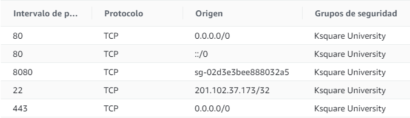

1.- Create an Express application to manage a TODO list

GET /todos

POST /todos

PUT  /todos/:id

DELETE /todos:id

2.- Deploy the application in an AWS instance using pm2. Don´t forget the security groups:

Allow 443, 80 for 0.0.0.0
Allow 22 for your IP address

3.- Set a proxy pass using nginx

4.- If you don´t have a domain, the application should be available via a virtual domain /etc/hosts

* Good usage of REST will be evaluated

Delivery format

1.- Screenshot of Security Group:
  
2.- Link to repository:

3.- Nginx configuration
4.- Screenshot of Pm2 running:
list and monitor

5.- Ip Address & Virtual domain