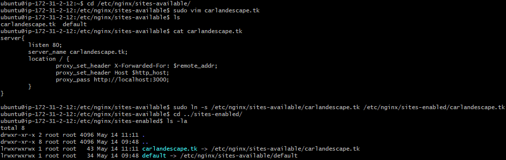
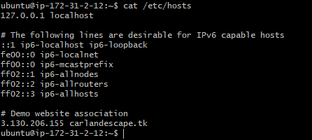
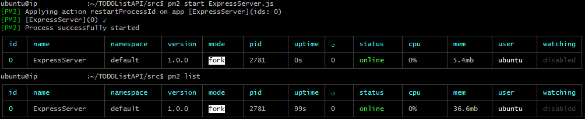

# Basic To Do List API using an Express Server

### Author: Carlos Andrés Escalona Contreras 
### Proposed by: Javier Solís
Main file: ExpressServer.js  
Created: 11/05/2021  
Updated: 20/05/2021

## Installation
### `git clone https://github.com/CarlosAEC-KS/ToDoListAPI`

## Start
### `npm run start`

## Testing
### `npm run test`

## Description
* Application to manage a to-do list running on an Express server which listens to requests on port 3000.

| Endpoint | Method | Description |
|-|-|-|
| /todos | GET | Retrieves all to-do entries stored in the database.|
| /todos | POST | Adds a new to-do|
| /todos/:id | PUT | Updates the information of the specified to-do.|
| /todos/:id | DELETE | Deletes the specified to-do.|

Example of entry in JSON format:  
```json
{
  "title":        "My new to-do", 
  "description":  "Finish my to-do",
  "deadline":     "2021-05-20T09:30:00",
  "important":    true
}
```
### Configuration
The application is deployed in an AWS EC2 instance using PM2 and NGINX as reverse proxy:

2. Security Group:  
Ports 443 & 80 allowed for connection from 0.0.0.0  
Port 22 allowed for connection from administration IP address
  

3. Proxypass NGINX configuration:
 


4. PM2 running:
* list
  
* monitor
  
5. Deployment
### http://carlandescape.tk