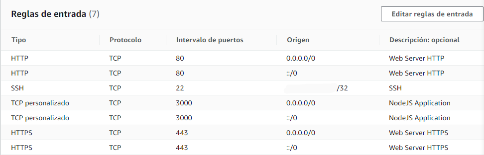
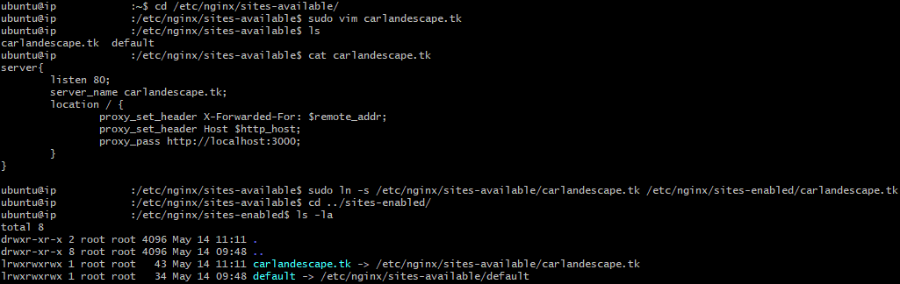
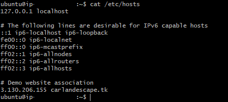
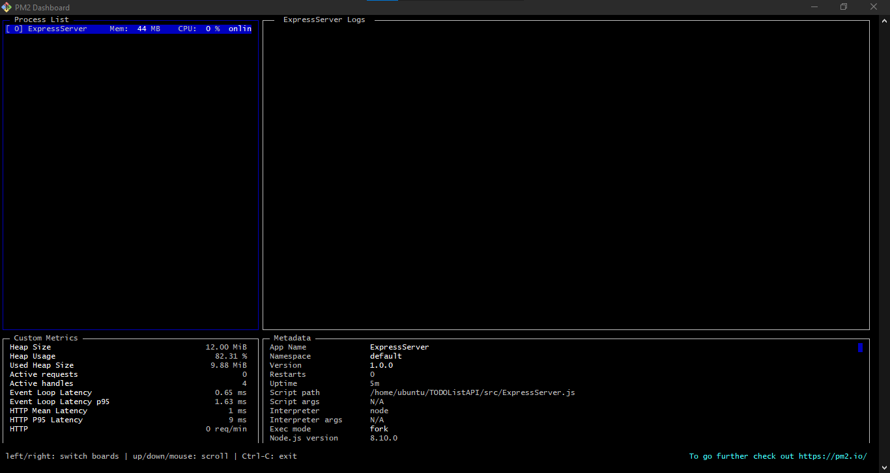

# Basic To Do List API using an Express Server

### Author: Carlos Andrés Escalona Contreras 
### Proposed by: Javier Solís
Main file: ExpressServer.js  
Created: 11/05/2021  
Updated: 14/05/2021

## Installation
### `git clone https://github.com/CarlosAEC-KS/ToDoListAPI`

## Start
### `npm run start`

## Testing
### `npm run test`

## Description
* Express server listening to requests on port 3000.

1. Express application to manage a TODO list.

| Endpoint | Method | Description |
|-|-|-|
| /todos | GET |
| /todos | POST |
| /todos/:id | PUT |
| /todos/:id | DELETE |

* Good usage of REST will be evaluated

The application is deployed in an AWS EC2 instance using PM2 and NGINX as reverse proxy:

2. Security Group:  
Allow PORTS: 443 & 80 for connection from 0.0.0.0  
Allow PORT 22 for for connection from your IP address  
  

3. Proxypass NGINX configuration:
 

4. PM2 running:
* list
  
* monitor
  
5. 
### Public IP Address: http://3.130.206.155:3000/
### Domain: carlandescape.tk